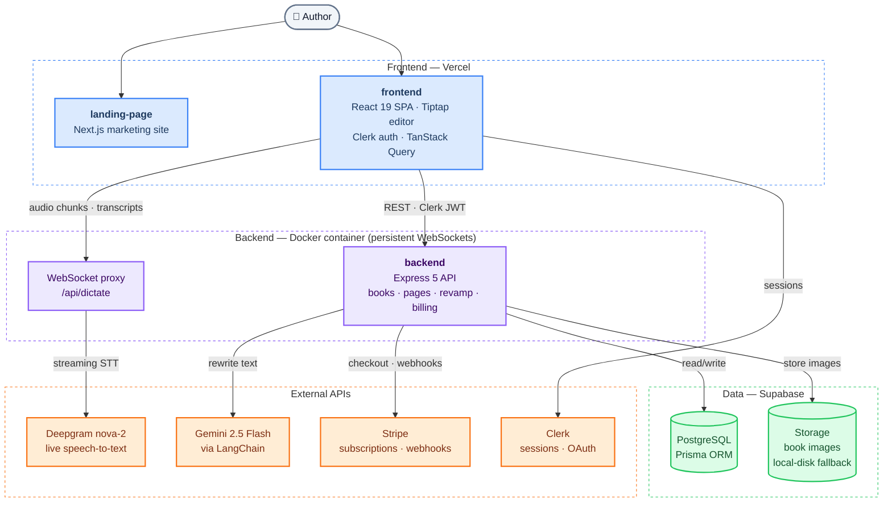
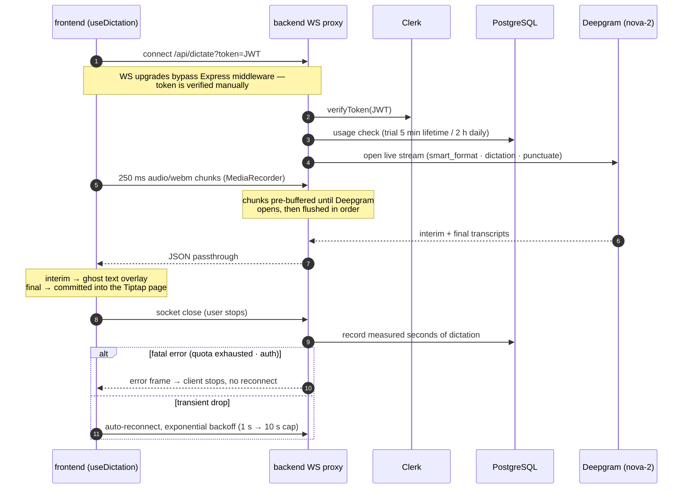

# RememberPress — speak your story, print your book

> Most people who want to write a book aren't writers. RememberPress is a book-writing platform for them: retirees preserving a life story, founders writing an authority book, families making a yearbook. You talk or type, live dictation turns speech into pages, AI polishes the prose in your book's voice — and what you see in the editor is exactly what prints.

**Live:** [rememberpress.com](https://rememberpress.com/) · **App:** [app.rememberpress.com](https://app.rememberpress.com/)

<!-- TODO(media): screenshots go in docs/media/ — suggested row: editor with dictation overlay · library · public reader -->
<!-- <p align="center">
  
</p> -->

## Why this exists

The people with the best stories are usually the least equipped to publish them. A 70-year-old with a lifetime of memories doesn't fight with Word margins or hire a ghostwriter — the story just never gets written. RememberPress removes the two real barriers: *getting words out* (speak instead of type, with live transcription) and *making it look like a real book* (a page-true editor that exports print-ready PDF). Built for a founder-led publishing business serving the Australian market — real paying subscribers, not a demo.

## How it works

1. **Create a book** — memoir, business book, or yearbook; the category shapes how the AI writes later
2. **Fill the pages** — type in a page-true editor, or hit dictate and watch live speech-to-text land on the page as you talk
3. **Revamp with AI** — select any passage and rewrite it in a chosen tone, with prompting tuned to the book's category (vivid and personal for memoirs, clear and authoritative for business)
4. **Ship it** — export a print-ready PDF straight from the editor, or publish a read-only web version anyone can read from a share link

## Architecture

Monorepo with three deployable units:

```
RememberPress/
├── landing-page/   # Marketing site — Next.js 15, static content-driven sections
├── frontend/       # Author app — React 19 + Vite SPA, Clerk auth, TanStack Query, Tiptap editor
└── backend/        # API + realtime — Express 5 + TypeScript, Prisma/Postgres, WebSocket dictation proxy
```



Everything user-facing is a plain REST round-trip except dictation, which is the interesting part: the browser streams microphone audio over a WebSocket to the backend, which proxies it to Deepgram and streams transcripts back — all metered and authenticated per user.

<details>
<summary><b>Zoom in: the live dictation pipeline</b> — auth, pre-buffering, metering, reconnects</summary>

<br/>



Implementation: `backend/src/websocket.ts` (proxy, auth, metering) · `frontend/src/hooks/useDictation.ts` (recorder, reconnect logic).

</details>

## Key technical decisions

- **Dictation is an authenticated, metered realtime proxy — not a browser API call.** Audio streams browser → backend → Deepgram, never browser → Deepgram. That one hop buys everything hard about realtime: the STT key stays server-side; Clerk JWTs are verified manually on the socket upgrade (upgrades bypass HTTP middleware entirely); quota is checked *before* the paid upstream opens; chunks that arrive during the Deepgram handshake are buffered and flushed in order so the author's first words survive; keepalives hold the stream through thinking pauses; and billing is computed from measured connection seconds on close. Error semantics are deliberate too — fatal frames (quota, auth) tell the client to stop, transient drops reconnect with exponential backoff.
- **The editor *is* the print pipeline.** The conventional design is a server-side PDF renderer that must be kept pixel-faithful to the editor forever — two rendering engines, one drift bug away from broken output. Inverted here: the editor enforces physical A4 constraints (a ProseMirror observer fires overflow warnings the instant content exceeds a printable page) and export prints the same DOM via `react-to-print`. WYSIWYG isn't tested for; it's true by construction, and there's zero rendering infrastructure to operate.
- **Page order is a database invariant, not application bookkeeping.** `@@unique([chapterId, order])` means Postgres itself rejects corrupted ordering — no "two page 3s" state can exist. The interesting consequence: drag-and-drop reorder can't naively rewrite orders (intermediate states collide), so it runs as a two-phase transaction — flip the moved pages to negative orders, then write finals — keeping the constraint satisfied at every instant, even under concurrent edits or mid-transaction failure.
- **Publishing is an immutable snapshot, not a permission flag.** The lazy version of sharing is `isPublic = true` on live tables. Instead, publish freezes the full book as denormalized JSON under a random `shareId`. Readers see a consistent edition, never a half-edited draft; the public endpoint does zero ownership logic (one indexed lookup, trivially cacheable); and unpublish deletes the snapshot in the same transaction that flips the flag — revocation is atomic and total.
- **Billing correctness over billing features.** Webhook signature verification demands byte-identical payloads, so the raw body is captured via `express.json({ verify })` *before* Clerk or anything else can touch the stream. Processed events are recorded against Stripe's unique event ID, making webhook handling idempotent under redelivery. Stale customer IDs from test→live mode switches are detected and recreated instead of failing checkout. Monthly runs as a subscription; yearly as a one-time payment.
- **One metering service, shared by HTTP and WebSocket entry points.** The pricing model (trial: 3 lifetime AI rewrites + 5 dictation minutes; subscribed: 40 LLM calls + 2 h dictation daily, AEST resets) lives in a single `UsageService` both protocols call. Trial rewrites are counted from the persisted revamp audit records themselves — the log *is* the counter, so usage accounting can't drift from the history it's supposed to reflect.

## Stack

| Layer | Tech |
|---|---|
| **Editor** | Tiptap 3 (ProseMirror) + custom extensions: LineHeight, ResizableImage, CharacterCount, page-overflow detection |
| **Frontend** | React 19 + Vite, React Router v7, TanStack Query v5, Tailwind v4 + shadcn/ui, Framer Motion |
| **AI & speech** | LangChain + Gemini 2.5 Flash (category-aware rewriting), Deepgram nova-2 (live streaming STT over `ws`) |
| **Backend** | Express 5, TypeScript, Zod validation, Prisma ORM, Winston logging |
| **Data & infra** | PostgreSQL (Supabase), Supabase Storage (local-disk fallback), Vercel (web), Docker (API — persistent WebSockets) |
| **Auth & payments** | Clerk (sessions + OAuth), Stripe (subscriptions, customer portal, webhooks) |

## Running locally

Each package has a `.env.example` — copy it to `.env` and fill in keys. You'll need a Postgres database (Supabase free tier works), a Clerk app, and Gemini + Deepgram API keys. Image uploads fall back to local disk if Supabase Storage isn't configured.

```bash
git clone https://github.com/Sahil2012/remember_publisher

# API + WebSocket proxy
cd backend
npm i && npx prisma generate
npm run dev                      # http://localhost:5000

# Author app (separate terminal)
cd frontend
npm i && npm run dev             # http://localhost:5173

# Landing page (optional)
cd landing-page
npm i && npm run dev             # http://localhost:3000
```

Each package has its own README with the next level of depth: [backend](backend/README.md) (API surface, ownership middleware, dictation proxy, usage rules, Stripe flows) · [frontend](frontend/README.md) (screens, route guards, editor internals, API-layer convention) · [landing-page](landing-page/README.md)

## Status

Live in production with paying subscribers. The full loop works end-to-end: create → dictate → AI revamp → print-ready PDF export → public share links, with Stripe billing (monthly subscription + yearly one-time) and per-plan usage metering. In progress: richer cover design options and print-fulfilment integration for hardbound copies.
